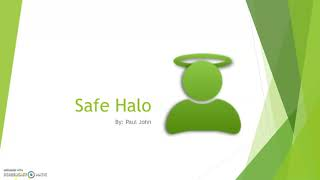
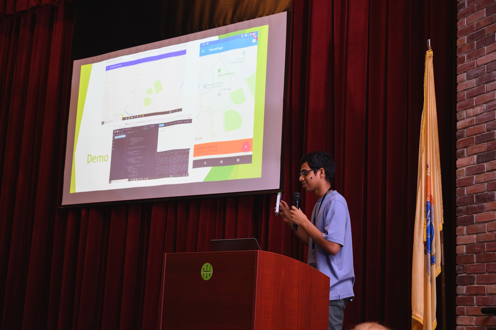

# Safe Halo Mobile App
Detects gunshots using machine learning and displays the location of other gunshots in the area on a map.

## Summary
Over the past several years, school shootings have been on the rise. An interesting statistic that has been overlooked with regards to school shootings is the response time when such a tragedy occurs. School shootings last on average for 12.5 minutes but, sadly, average police response time is 18 minutes. This is were Safe Halo comes in. Safe Halo reduces response time by eliminating the time between the first gunshot and the 911 call. A machine learning model running on smartphones and audio devices inside the school can detect gunshots and immediately contact emergency services. Once a gunshot is detected on school premises, teachers and administrators are also notified using a loud alert on their smartphones. Schools can now invest in a cost-effective product that will save precious lives in the case of a school shooting. School shootings happen in a matter of minutes so every second is valuable.

## Demo
This is a demo of my project:

Presenting the product at HackHunterdon III:

## Getting Started

This project is a starting point for a Flutter application.

A few resources to get you started if this is your first Flutter project:

- [Lab: Write your first Flutter app](https://flutter.dev/docs/get-started/codelab)
- [Cookbook: Useful Flutter samples](https://flutter.dev/docs/cookbook)

For help getting started with Flutter, view our 
[online documentation](https://flutter.dev/docs), which offers tutorials, 
samples, guidance on mobile development, and a full API reference.
